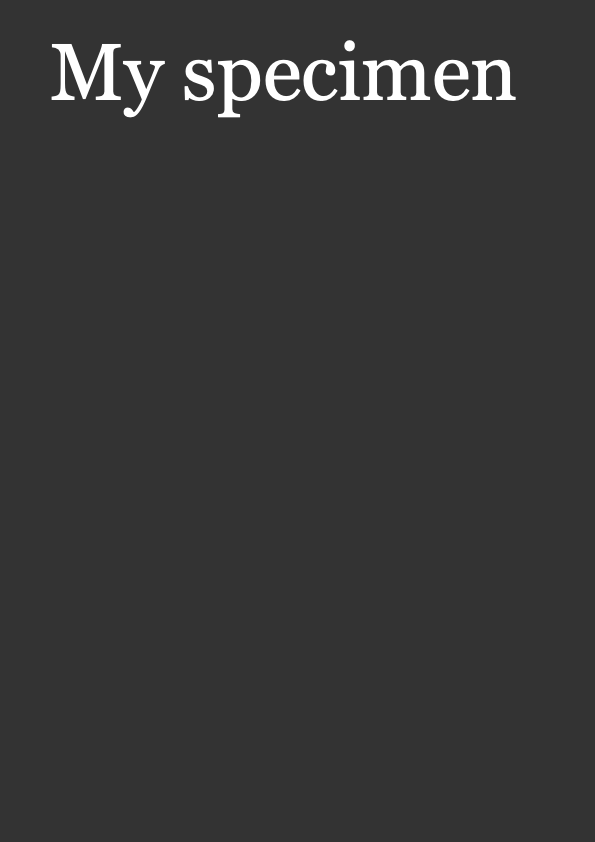

**(Use MacDown to view this document)**

# PageBotNano-002-Exporting
PageBotNano is a top-down evolving light-weight training version of PageBot. It is not compatible, but shares the same structure. 

## New to this version

* Adding the size of document, that is copied as default value for pages
* A **constants.py** file with standard paper sizes and other values that don’t change.
* Exporting to a **_export** folder that does not commit changes to Github.
* The **_export** folder if it does not exist.
* Fill the document page with a gray background and a white title for now.
* Export the document to show the result in this **README.md** file

## Gallery

The **gallery** folder contains example output result.

