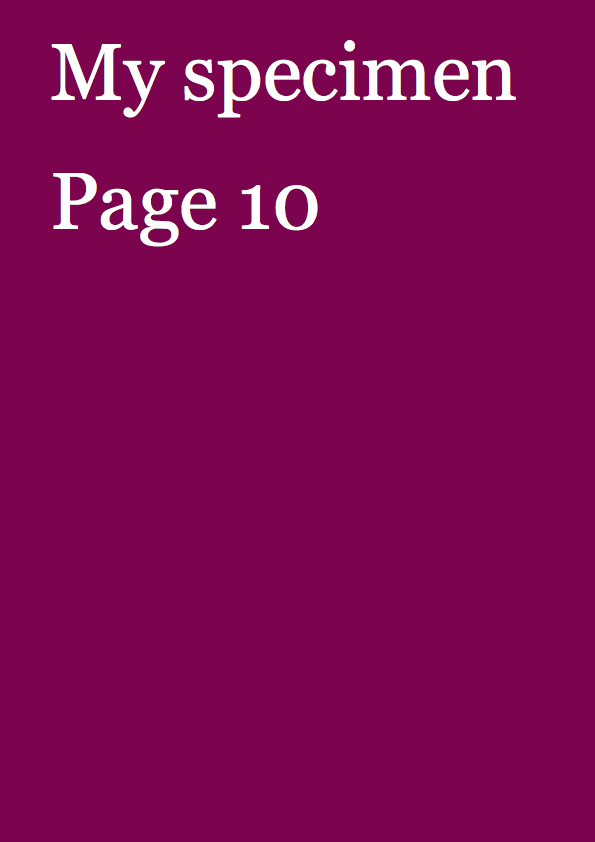

**(Use MacDown to view this document)**

# PageBotNano #005
PageBotNano is a top-down evolving light-weight training version of PageBot. It is not compatible, but shares the same structure. 

## New to this version

* Add **TextBox** element to make columns with overflow handling
* Add *toolbox/loremipsum generator* for test text, static and random
* Add body text pages to *MyTypeSpecimen.py* with loremipsum text
* Add **makeCoverPage** and **makeBodyPages** functions to *MyTypeSpecimen.py*
* Add boolean flag to Document for testing if **build()** already as been done before **export()**.
* Add clearDrawing() to Document.
* Add force attribute to **Document.export**, to force a new build before export
* Add multipage attribute to **Document.export**, in case exporting multiple *PNG* pages.
* Add example doc string to *toolbox/color*

## Gallery

