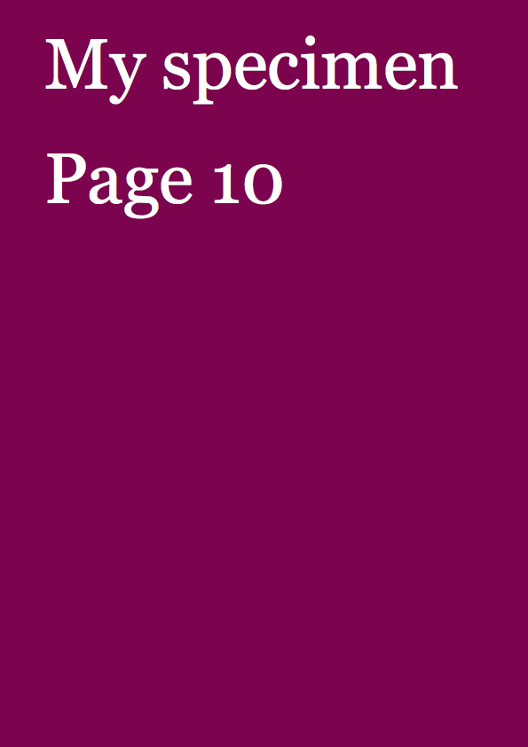

**(Use MacDown to view this document)**

# PageBotNano #004
PageBotNano is a top-down evolving light-weight training version of PageBot. It is not compatible, but shares the same structure. 

## Relation between classes

## New to this version

* Add folder for tools
* Add Rect class, inheriting from Element
* Add Text class, inheriting from Element
* Add position and size to Element __init__ constructor
* Add toolbox.color.asColor function to test valid values and make a tuple color
* Add Element.drawBackground and Element.drawForeground methods
* Add a color stroked square on the page.

## Gallery

